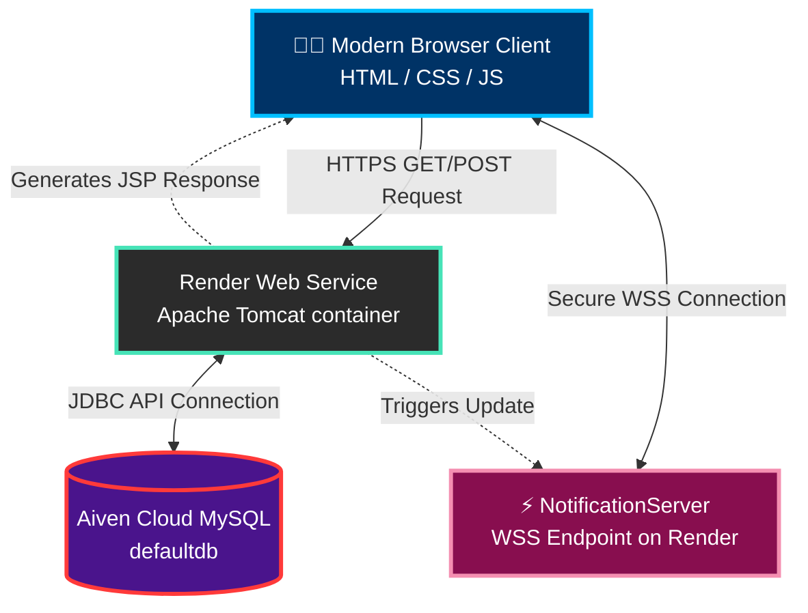

<div align="center">
  

  <h2>🌟 A Futuristic Complaint Management & Ticketing Ecosystem 🌟</h2>
  <p>
    Seamlessly resolve, track, and manage user complaints with a robust Java Servlet architecture, real-time WebSocket notifications, and an aesthetically superior User Interface.
  </p>
  
  <br/>
  <a href="https://cms-portal-8jiy.onrender.com" target="_blank">
    
  </a>
  <br/><br/>

  <!-- Badges -->
  <p>
    
    
    
    
    
  </p>
</div>

---

## 🚀 Features

Our system is engineered to handle complex user grievances efficiently, ensuring 100% transparency and instantaneous feedback.

- 🔐 **Multi-Role Authentication**: Secure login for `Admin`, `Technician`, and `User`.
- 🎫 **Smart Ticketing**: Lodge complaints with priorities, categories, and severity tags.
- ⚡ **Real-Time Updates**: Instant alerts powered by **WebSockets (wss://)**. No page refreshes!
- 📊 **Futuristic Dashboard**: Glassmorphism UI, advanced filtering, and instant data previews (Powered by Chart.js).
- 👨‍🔧 **Technician Portal**: Dedicated portal for technicians to pick up tickets, update status, and close issues.
- ☁️ **Cloud Native**: Pre-configured for Docker, Render deployments, and Aiven Cloud Database.

---

## 🛠️ Tech Stack & Architecture

### **System Architecture Diagram**



### **Core Components**
* **Frontend**: JSP, HTML5, CSS3, Vanilla JS (Glassmorphism UI)
* **Backend Engine**: Java Servlets, JSTL running on Tomcat 9.0
* **Real-time Logic**: `javax.websocket` Api (Supports both local `ws://` and production `wss://`)
* **Database**: Hosted remotely on **Aiven** MySQL 8.
* **Build System**: Apache Maven (`pom.xml`) & Docker (`Dockerfile`).

---

## 📂 Project Structure

```text
📦 cms-portal
 ┣ 📂 src/main/
 ┃ ┣ 📂 java/com/cms/
 ┃ ┃ ┣ 📂 dao/           # Data Access Objects (DB handlers)
 ┃ ┃ ┣ 📂 model/         # Java Beans / Entities
 ┃ ┃ ┣ 📂 servlet/       # Request Controllers
 ┃ ┃ ┣ 📂 util/          # Utilities (DatabaseConfig injected by Render Env)
 ┃ ┃ ┗ 📂 websocket/     # Real-time Servers
 ┃ ┗ 📂 webapp/          # Frontend & WEB-INF
 ┃   ┣ 📂 css/           # Styling & Animations
 ┃   ┣ 📜 WEB-INF/       # web.xml Deployment Descriptor
 ┃   ┣ 📜 index.jsp      # Landing Page
 ┃   ┗ 📜 ...            # Other Dashboards & Views
 ┣ 📜 pom.xml            # Maven Dependencies & Build
 ┣ 📜 Dockerfile         # Docker instructions for Render Cloud
 ┣ 📜 schema.sql         # DB Setup Scripts
 ┣ 📜 alter.sql          # DB Modifications
 ┗ 📜 README.md          # You are here!
```

---

## 🌐 Cloud Deployment Guide (Render + Aiven)

This project has been successfully containerized and deployed to the internet! Here is how the cloud ecosystem works:

### 1️⃣ Database (Aiven Cloud)
Instead of relying on a local MySQL engine, the tables (`schema.sql` & `alter.sql`) were injected into a free MySQL 8 cluster hosted on **Aiven**. 
* Because Aiven protects the DB creation rights and enforces the `defaultdb` name, the SQL scripts are optimized to run sequentially via the `mysql` CLI without `CREATE DATABASE` commands.

### 2️⃣ Web Service (Render.com)
The frontend and backend monolithic `.war` package is hosted on **Render**. 
* We created a multi-stage `Dockerfile` that uses `maven:3.8.4-openjdk-11` to clean and compile the project, and then seamlessly hands it over to `tomcat:9.0-jdk11` to run the active servlets.
* **Security:** Instead of hardcoding the Aiven Database password inside the public GitHub code, `DatabaseConfig.java` pulls the secret dynamically using `System.getenv("AIVEN_PASSWORD")`. The password is securely stored as an Environment Variable inside the Render Dashboard to respect GitHub's Push Protection policies.

---

## ⚙️ How to Setup & Run locally

### 1️⃣ Prerequisites
- **Java JDK 11+** installed.
- **Apache Maven** installed.
- **MySQL Server** installed and running.

### 2️⃣ Database Configuration
1. Login to your local MySQL server: `mysql -u root -p`
2. Create the database and import the schemas.
3. **Configure connection details**: Open `src/main/java/com/cms/util/DatabaseConfig.java` and type in your local MySQL password where the fallback string expects it.

### 3️⃣ Build and Run
1. Open up a terminal in the root project folder.
2. Build the project using Maven:
   ```bash
   mvn clean install
   ```
3. Run the embedded Tomcat server via Maven Plugin:
   ```bash
   mvn tomcat7:run
   ```
4. Access the futuristic CMS Portal at:  
   👉 **http://localhost:9090/**

---

<div align="center">
  <p>Built with ❤️. Taking ticket management to the cloud.</p>
</div>
