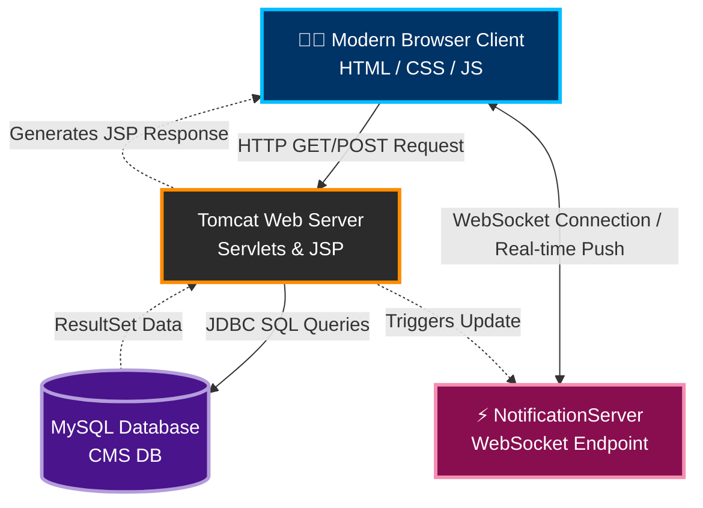

<div align="center">
  

  <h2>🌟 A Futuristic Complaint Management & Ticketing Ecosystem 🌟</h2>
  <p>
    Seamlessly resolve, track, and manage user complaints with a robust Java Servlet architecture, real-time WebSocket notifications, and an aesthetically superior User Interface.
  </p>

  <!-- Badges -->
  <p>
    
    
    
    
    
  </p>
</div>

---

## 🚀 Features

Our system is engineered to handle complex user grievances efficiently, ensuring 100% transparency and instantaneous feedback.

- 🔐 **Multi-Role Authentication**: Secure login for `Admin`, `Technician`, and `User`.
- 🎫 **Smart Ticketing**: Lodge complaints with priorities, categories, and severity tags.
- ⚡ **Real-Time Updates**: Instant alerts powered by **WebSockets**. No page refreshes!
- 📊 **Futuristic Dashboard**: Glassmorphism UI, advanced filtering, and instant data previews.
- 👨‍🔧 **Technician Portal**: Dedicated portal for technicians to pick up tickets, update status, and close issues.
- 🛡️ **Zero Data Leakage**: Prepared with proper `.gitignore` and security practices.

---

## 🛠️ Tech Stack & Architecture

### **System Architecture Diagram**



### **Core Components**
* **Frontend**: JSP, HTML5, CSS3, Vanilla JS (Glassmorphism UI)
* **Backend**: Java Servlets, JSTL
* **Real-time Logic**: `javax.websocket` Api 
* **Database**: MySQL Connect/J (JDBC driver)
* **Build System**: Apache Maven (`pom.xml`)

---

## 📂 Project Structure

```text
📦 cms-portal
 ┣ 📂 src/main/
 ┃ ┣ 📂 java/com/cms/
 ┃ ┃ ┣ 📂 dao/           # Data Access Objects (DB handlers)
 ┃ ┃ ┣ 📂 model/         # Java Beans / Entities
 ┃ ┃ ┣ 📂 servlet/       # Request Controllers
 ┃ ┃ ┣ 📂 util/          # Utilities (DB Configuration)
 ┃ ┃ ┗ 📂 websocket/     # Real-time Servers
 ┃ ┗ 📂 webapp/          # Frontend & WEB-INF
 ┃   ┣ 📂 css/           # Styling & Animations
 ┃   ┣ 📜 WEB-INF/       # web.xml Deployment Descriptor
 ┃   ┣ 📜 index.jsp      # Landing Page
 ┃   ┗ 📜 ...            # Other Dashboards & Views
 ┣ 📜 pom.xml            # Maven Dependencies & Build
 ┣ 📜 schema.sql         # DB Setup Scripts
 ┣ 📜 alter.sql          # DB Modifications
 ┗ 📜 README.md          # You are here!
```

---

## ⚙️ How to Setup & Run locally

### 1️⃣ Prerequisites
- **Java JDK 11+** installed.
- **Apache Maven** installed.
- **MySQL Server** installed and running.

### 2️⃣ Database Configuration
1. Login to your MySQL server: `mysql -u root -p`
2. Create the database and import the schemas:
   ```sql
   CREATE DATABASE cms_db;
   USE cms_db;
   source /path/to/schema.sql;
   source /path/to/alter.sql;
   ```
3. **Configure connection details**: Open `src/main/java/com/cms/util/DatabaseConfig.java` and type in your local MySQL password.
   > **⚠️ IMPORTANT:** Do **NOT** commit your real database password to GitHub! Always change it to a dummy password like "YOUR_PASSWORD" before using `git push`.

### 3️⃣ Build and Run
1. Open up a terminal in the root project folder.
2. Build the project using Maven:
   ```bash
   mvn clean install
   ```
3. Run the embedded Tomcat server via Maven Plugin:
   ```bash
   mvn tomcat7:run
   ```
4. Access the futuristic CMS Portal at:  
   👉 **http://localhost:9090/**

---

## 🔐 GitHub Upload Guide (IMPORTANT!)

**Uploading to GitHub without exposing your database password:**
1. **Database Password**: Your local DB password should never go into GitHub. We have provided instructions inside `DatabaseConfig.java`. When pushing, make sure the password in the code says `YOUR_MYSQL_PASSWORD_HERE`.
2. **Gitignore Setup**: We have added a proper `.gitignore` file that hides heavy compiled dependencies like the `target/` directory and `.class` files. You don't need `node_modules` for a Java backend project to be ignored; the Maven equivalent has been handled for you.

To safely push to GitHub, run:
```bash
git init
git add .
git commit -m "🚀 Initial release of futuristic CMS Portal"
git remote add origin https://github.com/YourUsername/YourRepoName.git
git branch -M main
git push -u origin main
```

---

<div align="center">
  <p>Built with ❤️. Taking ticket management to the next century.</p>
</div>
